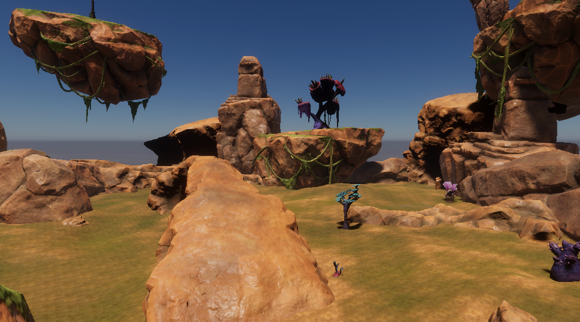

# Lost


__About__

__Game Project that is inspired by Expedition 33__

* Engine Configuration

|Engine|Version|
|------|-------|
|Unity| 6000.1.2f1|



## Structure
The project is composed of the following major classes:

### Player

The ```Player``` class has the following responsibilites:

* Input handling
* Spwaning of the view Camera
* Trigger the Battle Encounte
* Pass input to the ```MovementController```
  
### MovementController 

The ```MovementController``` class governs the movement of the character, it uses velocity and the ```CharacterController`` class to govern the movement of the character, itwill handle:

* Movement
* Jump and Gravity
* Update the animation parameters
* Convert Movement input tot world direction:

 ```c#
    Vector3 PlayerInputToWorldDirection(Vector2 inputValue) 
    {
        Vector3 rightDirection = Camera.main.transform.right;
        Vector3 fwdDirection = Vector3.Cross(rightDirection, Vector3.up);

        return rightDirection * inputValue.x + fwdDirection * inputValue.y;
    }
 ```

